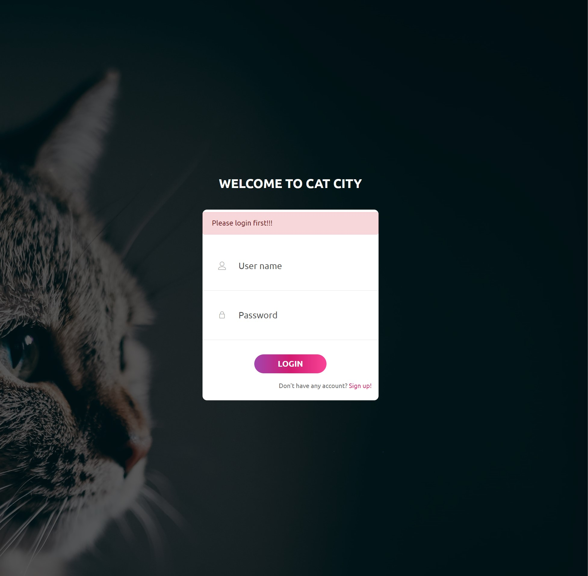
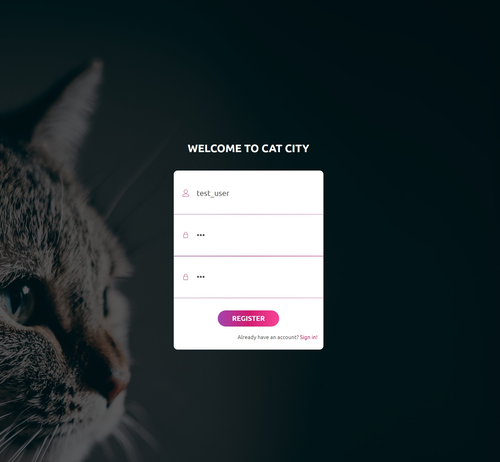
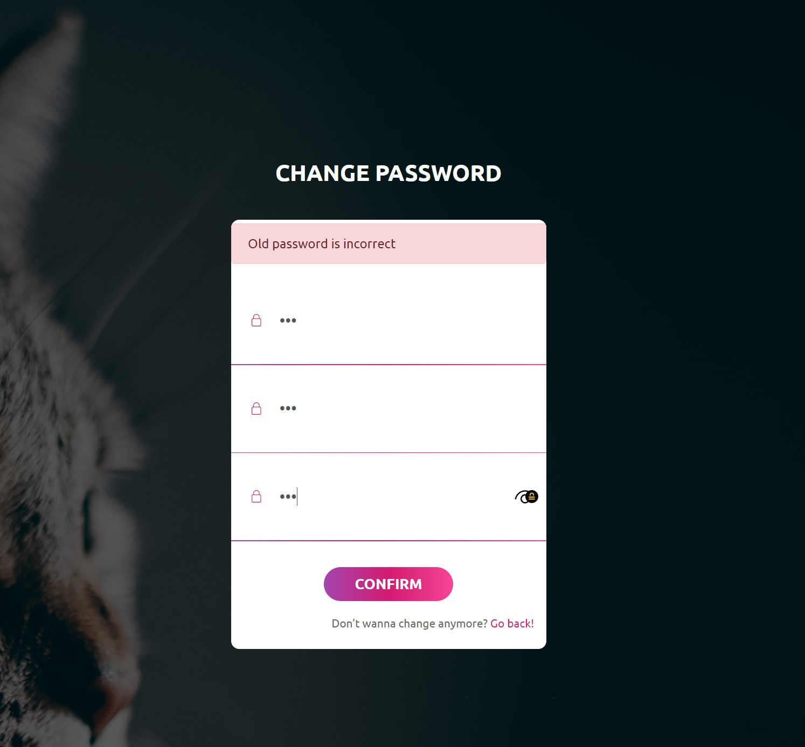
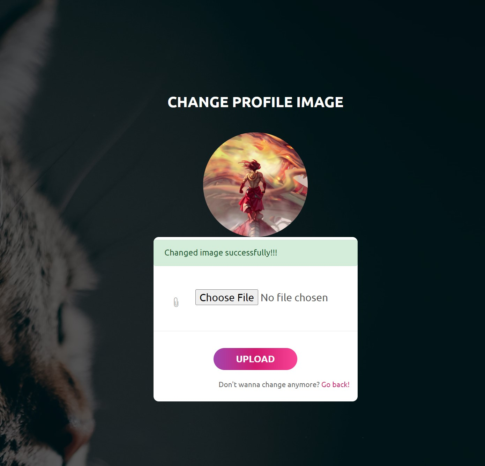

# Homework 2 developed by DBH
Clean looking profile with login features
# Installation
Install dependencies
```
pip install -r requirements.txt
```
Run server
```
python app.py
```
# Create `config.py` with these arguments:
```
USER_DB_DIR = 'database/logindb.txt'
IMAGES_ROOT = 'upload/'
SECRET_KEY = '<secret key>'
DATABASE_URI = '<your URI>'
UPLOAD_FOLDER = 'images'
ALLOWED_EXTENSIONS = {'png', 'jpg', 'jpeg', 'gif'}
```
# Tutorial
- `/login` - Login with your name and your password
- `/logout` - Logout from your account
- `/register` - Register an account
- `/upload/<filename>` - Access the uploaded file
- `/edit-pwd` - Change password
- `/edit-profile-pic` - Change profile picture

# Actions
-  Client can access image with route `/upload/<image_name>`
# Web page review
- Login page:



- Anonymous main page view:



- Logined main page view:


- Logined main page about:


- Change user password: 



- Change user avatar:


# phamvietanh-hw2
# hw2-wad
